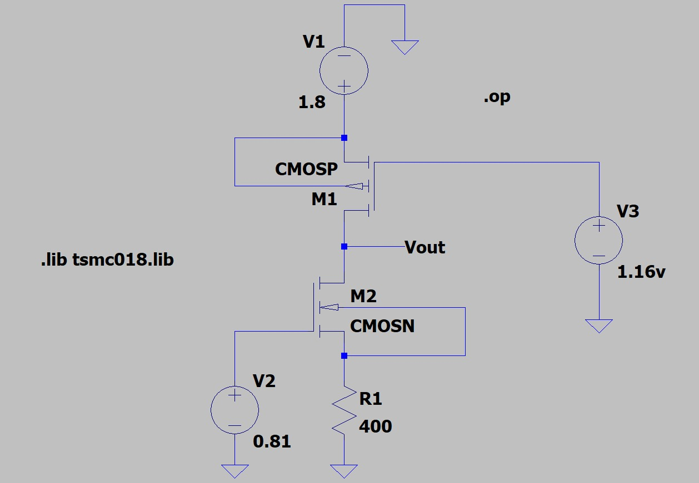
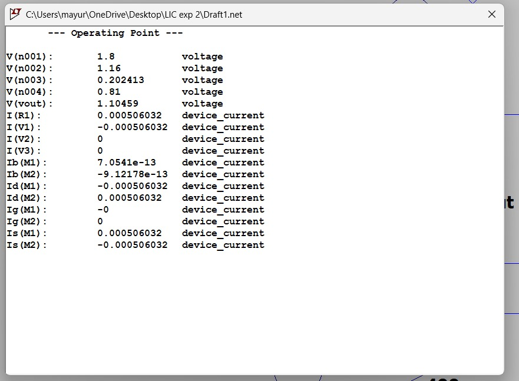
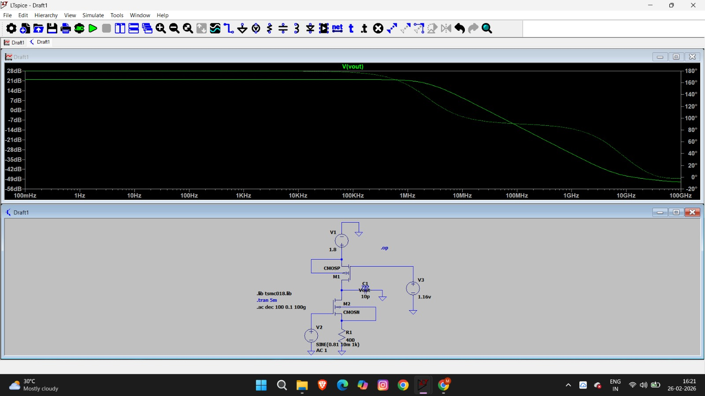
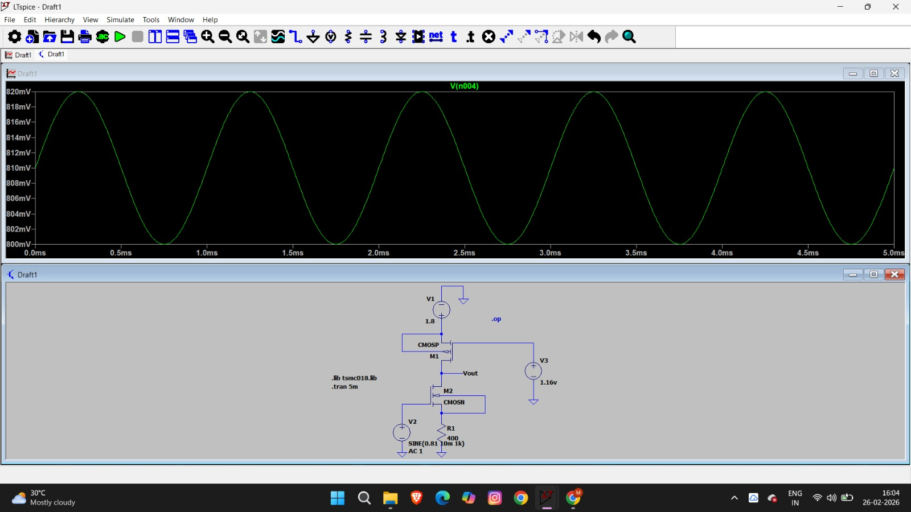

# Experiment 2

## DC, AC and Transient Analysis of Common Source Amplifier with Source Degeneration

### AIM
To design a Common Source (CS) amplifier with an NMOS transistor and source degeneration using TSMC 180nm technology in LTspice. The design must adhere to a supply voltage of 1.8V and a power constraint of $\leq 1mW$, and involve evaluating the DC operating point, transient response, voltage gain, and bandwidth.

---

### 1. Introduction
**What is an NMOS Common Source Amplifier with Source Degeneration?**
The Common Source (CS) amplifier is a fundamental building block in analog IC design. In this configuration:
* **Source Degeneration:** A resistor ($R_s$) is placed at the source to provide negative feedback, which improves linearity and stabilizes the gain.
* **Active Load:** A PMOS transistor is used as a load to achieve high gain within the $1.8V$ supply limit.

---

### 2. Working Principle
For proper amplification, transistors must be in the **Saturation Region**.
* **Saturation Condition:** $V_{DS} \geq V_{GS} - V_{th}$ (for NMOS) and $V_{SD} \geq V_{SG} - |V_{thp}|$ (for PMOS).
The voltage gain is stabilized by $R_s$ and is approximately:
$A_v \approx - \frac{g_m(r_{o1} || r_{o2})}{1 + g_m R_s}$

---

### 3. Design Calculations
The design is carried out step-by-step based on the given constraints.

#### Step 1: Power Budget and Drain Current ($I_D$)
Given $P \leq 1mW$ and $V_{DD} = 1.8V$:
$$I_D = \frac{P}{V_{DD}} = \frac{1 \times 10^{-3}}{1.8} = 555.5 \mu A$$
**We select $I_D = 500 \mu A$** to stay safely within the power limit.

#### Step 2: Determining Node Voltages and $R_s$
To ensure symmetrical swing and stability:
* **Source Resistor ($R_s$):** We allocate a voltage drop of $0.2V$ across $R_s$.
  $$V_{Rs} = 0.2V$$
  $$R_s = \frac{V_{Rs}}{I_D} = \frac{0.2V}{500 \mu A} = \mathbf{400 \Omega}$$
* **Output Voltage ($V_{out}$):** We set the quiescent output voltage to:
  $$V_{out} = \frac{V_{DD}}{2} + 0.2V = 0.9V + 0.2V = \mathbf{1.1 V}$$

#### Step 3: NMOS Gate Bias and Overdrive Voltage
* Using **$V_{ov} = 0.25V$** and **$V_{thn} = 0.36V$**:
  $$V_{GS} = V_{thn} + V_{ov} = 0.36V + 0.25V = 0.61V$$
* **Gate Voltage ($V_{B1}$):**
  $$V_{B1} = V_{GS} + V_{Rs} = 0.61V + 0.2V = \mathbf{0.81 V}$$

#### Step 4: Transistor Sizing ($W/L$)
Using the saturation current formula: $I_D = \frac{1}{2} k_n' \frac{W}{L} V_{ov}^2$
From the process library, $k_n' \approx 277 \mu A/V^2$:
* **For NMOS:**
  $$500 \mu A = \frac{1}{2} (277 \mu A/V^2) \frac{W_n}{180nm} (0.25)^2$$
  Solving for $W_n$:
  **$W_n \approx 11.6 \mu m$**
* **For PMOS:**
  To match the $500 \mu A$ current with $V_{B2} = 1.16V$ and $L = 180nm$:
  **$W_p \approx 29.5 \mu m$**

---

### 4. Circuit Schematic
The schematic below was constructed in LTspice using the `tsmc018.lib` library.

---

### 5. Simulation Results

#### A. DC Operating Point Analysis
The simulation was performed to verify the quiescent points ($I_D$ and $V_{out}$).

* **Simulated $I_D$:** $506 \mu A$ (Matches $500\mu A$ target)
* **Simulated $V_{out}$:** $1.104 V$ (Matches $1.1V$ target)
* **Simulated $V_s$:** $0.202 V$ (Matches $0.2V$ target)

#### B. Transient Analysis
A $1kHz$ sine wave with $10mV$ amplitude ($20mV$ p-p) was applied.

* **$V_{in(p-p)}$:** $19.99 mV$
* **$V_{out(p-p)}$:** $0.25 V$
* **Calculated Gain ($A_v$):** $\frac{0.25}{0.0199} = \mathbf{13.15}$

#### C. AC Analysis (Frequency Response)
The frequency response was analyzed with a $10pF$ load capacitor.

* **Mid-band Gain:** $21.95 dB$
* **3dB Bandwidth:** $2.276 MHz$
* **Unity Gain Bandwidth (UGB):** $27.905 MHz$

---

### 6. Result Comparison

| Parameter | Theoretical / Target | Simulated |
| :--- | :--- | :--- |
| **Drain Current ($I_D$)** | $500 \mu A$ | $506 \mu A$ |
| **Output Voltage ($V_{out}$)** | $1.1 V$ | $1.104 V$ |
| **Source Voltage ($V_s$)** | $0.2 V$ | $0.202 V$ |
| **Voltage Gain ($A_v$)** | $23.74 dB$ | $21.95 dB$ |
| **3dB Bandwidth** | - | $2.276 MHz$ |

---

### 7. Inference
1. **Power Constraint:** The actual power dissipated is $1.8V \times 506 \mu A = 0.91mW$, which satisfies the $P \leq 1mW$ constraint.
2. **Gain Analysis:** The slight difference between theoretical and simulated gain is due to the **Body Effect** and **Channel Length Modulation** ($\lambda$).
3. **Capacitive Loading:** The $10pF$ capacitor significantly reduces the bandwidth by moving the output pole to a lower frequency.
4. **Saturation:** All transistors were confirmed to be in the saturation region for proper linear operation.
